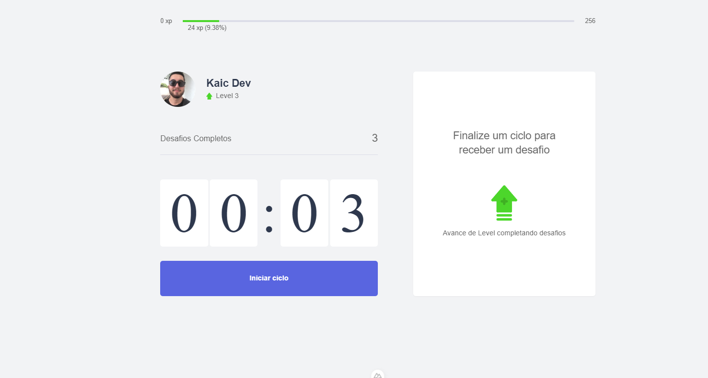
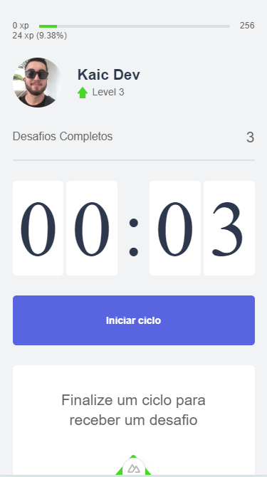

<h1 align="center">
  Move.it
</h1>

<p align="center">
  <a href="#-projeto">Projeto</a>&nbsp;&nbsp;&nbsp;|&nbsp;&nbsp;&nbsp;
  <a href="#-tecnologias-utilizadas">Tecnologias Utilizadas</a>&nbsp;&nbsp;&nbsp;|&nbsp;&nbsp;&nbsp;
  <a href="#-como-executar">Como executar</a>&nbsp;&nbsp;&nbsp;|&nbsp;&nbsp;&nbsp;
  <a href="#-licença">Licença</a>
</p>

<p align="center">
  
  
</p>

## 💻 Projeto

Move It - é uma aplicação que permite você executar a técnica de Pomodoro para focar nas suas atividades. Ao final de cada ciclo, um desafio lhe é proposto para que você descanse e se exercite.

Projeto desenvolvido durante a NLW - Next Level Week 4 oferecida pela Rocketseat, porém realizada com o framework Vue.js e Nuxt.js, além de outras tecnologias front end.


## ✨ Tecnologias utilizadas

Esse projeto foi desenvolvido com as seguintes tecnologias:

- [Nuxt.js 3](https://nuxt.com/docs/getting-started/installation)
- [Typescript](https://www.typescriptlang.org/)
- [Pinia](https://pinia.vuejs.org/introduction.html)
- [Tailwindcss](https://tailwindcss.com/docs/installation)
- [Docker](https://docs.docker.com/guides/get-started/)

## 🚀 Como executar

- Você precisa instalar o [Nuxt](https://nuxt.com/docs/getting-started/installation) para executar este projeto.

**Clone o projeto**

```bash
  git clone https://github.com/kaicLimaOliveira/Move.it.git
```

**Siga os passo abaixo**

```bash
  #Utilize para instalar todas as dependências
  yarn

  #Para executar o projeto
  yarn dev

```

### Configuração cutomizada

Veja [Referência configuração](https://cli.vuejs.org/config/).

## 📄 Licença

Esse projeto está sob a licença MIT. Veja o arquivo [LICENSE](LICENSE) para mais detalhes.

---

<a href="https://kaicLimaOliveira.github.io">
 
 <br />
 <sub><b>Kaic de Lima Oliveira</b></sub></a>

Feito por Kaic de Lima Oliveira 👋🏽 Entre em contato!

[](https://www.facebook.com/kaic.oliveira.587) [](https://www.instagram.com/kaic.lo)
[](mailto:kaic10@outlook.com)
[](https://www.linkedin.com/in/kaic-de-lima-oliveira-3633041a4/)